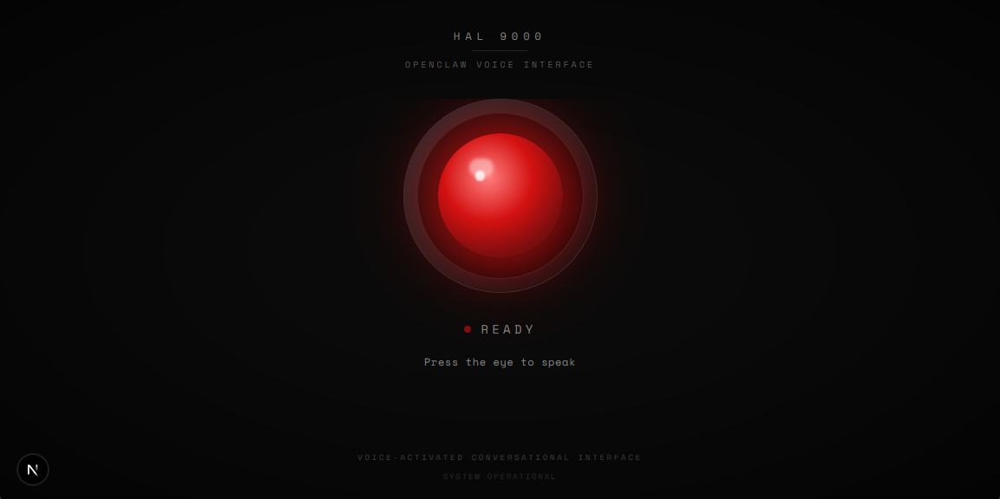

# OpenClaw HAL Assistant

OpenClaw HAL Assistant is a HAL 9000-inspired voice assistant API built with Next.js App Router. It exposes speech-to-text, text-to-speech, and chat endpoints backed by ElevenLabs and OpenClaw services.



## Presentation

- **Persona**: conversational assistant with HAL 9000 style responses
- **Runtime**: Next.js server with route handlers in `app/api/*`
- **Dependencies**: ElevenLabs (STT/TTS), OpenClaw chat gateway
- **Deployment**: Container-ready with standalone server output and Docker stack

## Quick Start

1. Install dependencies

```bash
pnpm install
```

2. Create environment file

```bash
cp .env.example .env
```

3. Fill required variables in `.env`:

- `ELEVENLABS_API_KEY`
- `ELEVENLABS_VOICE_ID`
- `OPENCLAW_GATEWAY_URL`
- `OPENCLAW_GATEWAY_TOKEN`

4. Optional: enable wake-word activation with Porcupine

- Create a Picovoice account and get an `AccessKey`: https://console.picovoice.ai/
- Configure:
  - `OPENCLAW_WAKE_WORD_ACCESS_KEY`
  - `OPENCLAW_WAKE_WORD_MODEL_PATH` (for example `/porcupine_params.pv`)
  - `OPENCLAW_WAKE_WORD_KEYWORD_PATH` for custom wake phrases (required when not using a built-in keyword)
- If wake config is missing/invalid, the app falls back to manual mode (eye button).

5. Start the app

```bash
pnpm dev
```

6. Call endpoints (examples)

Submit chat and receive an immediate response:

```bash
curl -X POST http://localhost:3000/api/chat \
  -H "Content-Type: application/json" \
  -d '{"message":"Hello HAL"}'
```

```bash
curl -X POST http://localhost:3000/api/tts \
  -H "Content-Type: application/json" \
  -d '{"text":"Hello from HAL"}' \
  --output response.mp3
```

## Documentation

- [Environment Variables](./docs/environment.md)
- [API Reference](./docs/api.md)
- [Deployment](./docs/deployment.md)
- [Testing](./docs/testing.md)
- [Release Guide](./docs/release.md)
- [Review and Gaps](./docs/review-and-gaps.md)

## UI behavior flags

- `OPENCLAW_TEXT_TRANSLATIONS_ENABLED=true` shows transcript/response panels and a UI button to show/hide them.
- `OPENCLAW_TEXT_TRANSLATIONS_ENABLED=false` hides transcript/response panels entirely.

## OpenAPI and docs UI

- `/api/openapi` serves generated OpenAPI JSON (writes to `public/openapi.json`)
- `/api/docs` serves Swagger UI when docs are enabled via `OPENCLAW_API_DOCS_ENABLED`

## Available Scripts

- `pnpm dev` – run development server
- `pnpm build` – build Next.js app (prebuild verifies env)
- `pnpm start` – run production server
- `pnpm test` – run unit/integration tests
- `pnpm test:e2e` – run Playwright E2E (if configured)
- `pnpm gen:openapi` – generate OpenAPI spec
- `pnpm docker:build` – build container image
- `pnpm docker:run` – run single container with `.env`
- `pnpm docker:up` / `pnpm docker:down` – compose control
- `pnpm docker:logs` – stream compose logs

### Release scripts

- `pnpm release:patch` – bump PATCH, commit, and tag
- `pnpm release:minor` – bump MINOR, commit, and tag
- `pnpm release:major` – bump MAJOR, commit, and tag
- `pnpm release:version <x.y.z>` – bump to explicit version and tag

Use `--push` to push commit and tags after local release prep:

```bash
pnpm release:patch -- --push
```

A GitHub release (tag `vX.Y.Z`) triggers `.github/workflows/docker-release.yml`,
which validates tests and builds, then publishes Docker images to Docker Hub as:

- `${DOCKERHUB_USERNAME}/openclaw-hal-assistant:vX.Y.Z`
- `${DOCKERHUB_USERNAME}/openclaw-hal-assistant:latest`

For the complete release playbook (including rollback), see:

- [docs/deployment.md](./docs/deployment.md)
